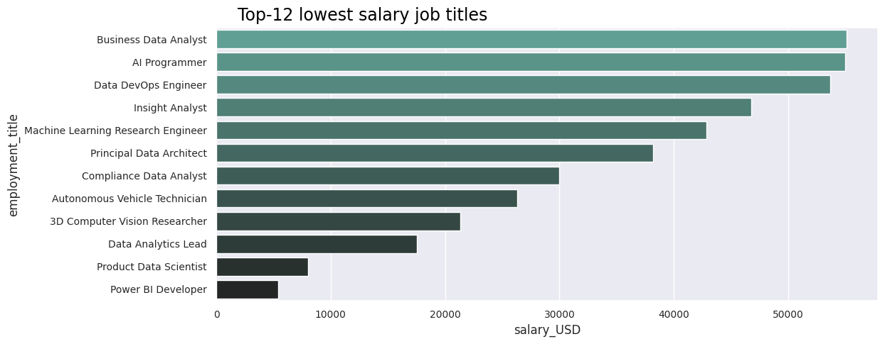

# PRIOR KNOWLEDGE
---
### Key factors of the domain
When analyzing data science salaries in 2023, several key factors need to be considered to provide accurate and meaningful insights. These factors include:
+ **Work Year**: The number of hours or days an employee works per year, which can vary based on full-time, part-time, or contractual arrangements.
+ **Experience Level**: The number of years of relevant experience in the field of data science, which significantly influences salary levels.
+ **Employment Type**: Whether the position is full-time, part-time, contract-based, or freelance, as different employment types offer varying salary structures and benefits
+ **Employment Title**: The specific role within the data science domain, such as data scientist, data analyst, machine learning engineer, or AI researcher, each with its own salary range.
+ **Salary USD**:  The equivalent salary amount converted to US dollars, which provides a standardized comparison for salaries across different countries and currencies.
+ **Employment location**: The location where the employment resides, as salaries can vary significantly based on different countries.
+ **Remote Ratio**: The proportion of remote work allowed in the job, ranging from fully remote positions to those requiring on-site presence.
+ **Employe location**: We can provide career recommendations by suggesting a relocation for the employee based on their current place of residence.
Analyzing data science salaries in 2023 involves considering these factors in combination to provide a comprehensive understanding of the salary landscape in the field. Data scientists and analysts use statistical techniques and data modeling to extract meaningful insights from salary data, considering these variables and their interactions to draw accurate conclusions about salary trends and patterns.

### Business Questions
Following are the business question which we're going to answer by our insights through data science process.
+ **Job Recommendation**:Business Question: Can we suggest a job based on the user's current employment title, experience, and current salary?
+ **Salary Recommendation**: Business Question: Is it possible for us to suggest salaries based on experience?
+ **Location-Based Analysis:**  Business Question: How does the geographic location impact career opportunities and salaries in Data Science, and what recommendations can be provided for individuals considering relocation for their career?
+ **Analysis of Career Growth:** Business Question: What are the various factors that influence the growth of salary in the field of Data Science, including job title and location? Additionally, what recommendations can be made to ensure that salaries of professionals in this field stay competitive based on their job title and location?
+ **Salary Prediction** Business Question: Can future salaries for data science be predicted by considering factors like experience and job title?

### Data Collection
This is the prior knowledge phase to gather relevant data about career recommendation of data science, including its subfield such as data analyst, machine learning etc. We have sourced this data from kaggle to ensure that we meet our requirements then we can able to answer the business questions that are necessary in the data science process.

Sources from which we collect data 
[Kaggle](https://www.kaggle.com/datasets)

# DATA PREPARATION
---
Our Dataset contains 3755 rows × 11 columns which include featuers of data science and these attributes has relationship among them and we'll explore the data by visualization with various libraries available in python to visualize data.

### Importing Libraries
We need to import libraries that are required to process dataset, which will be using to clean data and which are using to visualize data

```python
#Following libraries will be used to perform data exploration
import pandas as pd
import numpy as np
import seaborn as sns                       #Visualisation
import matplotlib.pyplot as plt             #Visualisation
%matplotlib inline
sns.set(color_codes=True)
```

### Loading the data into the data frame
Loading the data into a data frame using the Python library pandas is the initial and crucial step in data exploration or exploratory data analysis. Hence, we must read our CSV file named "ds_salaries2023.csv" that contains a collection of rows and columns and is located in the directory.

```pytho
from google.colab import drive
drive.mount('/content/drive')
```
```pytho
df = pd.read_csv("/content/drive/MyDrive/DSDataSet/ds_salaries2023.csv")
df
```
Now, we will demonstrate the size of our existing unstructured data set prior to cleaning, which will facilitate the comparison of its size post data preparation.


The execution of the given line of code will generate the visualization of the dataset, displaying its rows and columns.

```pytho
df #just to show the consitency of the data we're going to show the top 5 and bottom 5 rows of the dataset
```


Furthermore, we will present the dataset's information, which will help us to understand the dataset.


The DataFrame contains data description and generates statistical summaries that depict the distribution's central tendency and shape, excluding NaN values. Additionally, the percentile indicates the number of values that are less than the specified percentile, provided that the DataFrame comprises numerical data.


### Data type verification
It is important to note that the dataset may consist of attributes of different types. In situations where the data is categorical, it is crucial to transform them into continuous numeric attributes.


---
# 3 - EXPLORATORY DATA ANALYSIS (EDA)
In the exploratory data analysis, We will be looking at the data and try to understand the data. I will begin by looking at the distribution of data across the dat-set, followed by visualising the data to understand the relationship between the features and the target variable.

## 3.1 Work Year
We will showcase the dataset comprising the work done in the years 2020 to 2023.
```pytho
df['work_year'].value_counts()
```
2023    1065

2022    1011

2021    223

2020    75

Name: work_year, dtype: int64

```pytho
plt.figure(figsize=(16,20))
plt.subplot(121)
df['work_year'].value_counts().plot(kind="pie",autopct="%2f",explode=(0.1,0.1,0,0))
plt.title('Job Count by Year')
plt.ylabel('Work Year Count')
plt.savefig("work_year.png")
plt.legend()
plt.show()
plt.savefig("work_year_distribution.png")
```


From above numbers we can say that, we have
```pytho
# A data from 2020 to 2023. Total we have 4 year of data.
```
Based on above counts/data its looks like the requirement of data scientist increased as per years.

## 3.2 Experience Level
The Following lines of code demonstrate the count of job positions categorized by their level of experience in the field of data science.

```pytho
df['experience_level'].value_counts()
```
Senior-Level / Expert         1395

Mid-Level / Intermediate       623

Entry-Level / Junior           261

Executive-Level / Director      95

Name: experience_level, dtype: int64

```pyth
plt.figure(figsize=(16,20))
plt.subplot(121)
df['experience_level'].value_counts().plot(kind="pie",autopct="%2f",explode=(0,0,0,0))
plt.title('Job count by work experience')
plt.savefig("exp_level.png")
plt.legend()
plt.show()
plt.savefig("exp_level_distribution.png")
```


## 3.3 Employment Type
The code below demonstrates the total count of job types present in our dataset.
```pytho
df['employment_type'].value_counts()
```

Full-Time    2337

Part-Time      17

Contract       10

Freelance      10

Name: employment_type, dtype: int64

```pytho
plt.figure(figsize=(16,20))
plt.subplot(121)
df['employment_type'].value_counts().plot(kind="pie",autopct="%2f",explode=(0,0,0,0))
plt.title('Job count by work experience')
plt.savefig("employment_type.png")
plt.legend()
plt.show()
plt.savefig("employment_type_distribution.png")
```


The graph and statistics above indicate a substantial higher number of job opportunities available for full-time employment in the field of data science.

## 3.4 Job Title

### 3.4.a Job title with fewest no. of jobs
We are going to visualize the job titles with the lowest number of job occurrences in our dataset.

```pytho
df.employment_title.value_counts().nsmallest(50).plot(kind='bar',figsize=(10,5),color="red")
plt.title('Job Title with the fewest number of jobs')
plt.ylabel('ratio')
plt.xlabel('Employment/Job Title')
```

The dataset contains only one occurrence of the following job titles.

```pytho
df['employment_title'].value_counts()[df['employment_title'].value_counts() < 2]
```

Head of Machine Learning               1

Principal Data Architect               1

Staff Data Scientist                   1

Product Data Scientist                 1

Cloud Data Architect                   1

BI Data Engineer                       1

Power BI Developer                     1

Data Science Tech Lead                 1

Data Management Specialist             1

Principal Machine Learning Engineer    1

Manager Data Management                1

Marketing Data Engineer                1

Azure Data Engineer                    1

Compliance Data Analyst                1

Deep Learning Researcher               1

Staff Data Analyst                     1

Data DevOps Engineer                   1

Finance Data Analyst                   1

Name: employment_title, dtype: int64

### 3.4.b Job title with highest no. of jobs
We are going to visualize the job titles with the highest number of job occurrences in our dataset.
```pytho
df.employment_title.value_counts().nlargest(50).plot(kind='bar',figsize=(10,5),color="green")
plt.title('Job Title with the highest number of jobs')
plt.ylabel('ratio')
plt.xlabel('Employment/Job Title')
```


### 3.4.c Top 10 highest No. of job in data science
The dataset reveals the visualization by the pie chart of the employment sector that has the highest number of jobs.
```pytho
df['employment_title'].value_counts().sort_values(ascending=False).head(10)
```
Data Engineer                521

Data Scientist               479

Data Analyst                 348

Machine Learning Engineer    196

Analytics Engineer            85

Data Architect                64

Research Scientist            63

Data Science Manager          52

ML Engineer                   34

Research Engineer             33

Name: employment_title, dtype: int64

```pytho
plt.figure(figsize=(16,20))
plt.subplot(1,2,1)
df['employment_title'].value_counts().sort_values(ascending=False).head(10).plot(kind="pie",shadow=True,explode = (0.3,0,0,0,0,0,0,0,0,0),autopct="%2f")
plt.title('Top 10 Job Count by Title')
plt.ylabel('Employment/Job Title')
plt.legend()
plt.savefig("most_employment_title.png")
plt.show()
```


## 3.5 Employee Salary
The visualization of employees' salaries is necessary in order to identify any outliers within the dataset. To detect these outliers, it is essential to visualize salary column.

### 3.5.a Detecting Outliers
**Box Plot Before Removing Outliers**

```pytho
sns.boxplot(x=df['salary_USD'], color = 'yellow')
```


The box plot above illustrates that the majority of employee salaries fall under 200,000, while a few salaries are beyond the range of 300,000 that may become an outliers and if there are any outliers in our dataset, it is necessary to eliminate them by identifying the quantile in our dataset.

### 3.5.b Removing Outliers
**Finding 1st Quartile, 3rd Quartile and Interquartile Range**

```pytho
Q1 = df.quantile(0.25, numeric_only = True)
Q3 = df.quantile(0.75, numeric_only = True)
IQR = Q3 - Q1
print('Q1(quantile - 0.25) = ', Q1)
print('----------------------------------------------')
print('Q3(quantile - 0.75) = ', Q3)
print('----------------------------------------------')
print('IQR(Q3 - Q1) = ', IQR)
```

<table>
  <tr>
    <td>Q1(quantile - 0.25) =  work_year      2022.0</td>
  </tr>
  <tr>
    <td>salary_USD    82783.0</td>
  </tr>
  <tr>
    <td>Name: 0.25, dtype: float64</td>
  </tr>
    <tr>
    <td>----------------------------------------------</td>
  </tr>
    <tr>
    <td>Q3(quantile - 0.75) =  work_year       2023.0</td>
  </tr>
  <tr>
    <td>salary_USD    175100.0</td>
  </tr>
    <tr>
    <td> Name: 0.75, dtype: float64</td>
  </tr>
    <tr>
    <td>----------------------------------------------</td>
  </tr>
   <tr>
    <td>IQR(Q3 - Q1) =  work_year         1.0</td>
  </tr>
   <tr>
    <td>salary_USD    92317.0</td>
  </tr>
   <tr>
    <td>dtype: float64</td>
  </tr>
</table>

**Removing Outliers from dataframe**
```pytho
df_fix = df[~(((df < (Q1 - 1.5 *   IQR)) | (df > (Q3 + 1.5 *   IQR))).any(axis=1))]
df_fix.head(5)
```

```pytho
<ipython-input-75-4232eee1673b>:1: FutureWarning: Automatic reindexing on DataFrame vs Series comparisons is deprecated and will raise ValueError in a future version. Do `left, right = left.align(right, axis=1, copy=False)` before e.g. `left == right`
  df_fix = df[~(((df < (Q1 - 1.5 *   IQR)) | (df > (Q3 + 1.5 *   IQR))).any(axis=1))]
```

<table border="1" class="dataframe">
  <thead>
    <tr style="text-align: right;">
      <th></th>
      <th>work_year</th>
      <th>experience_level</th>
      <th>employment_type</th>
      <th>employment_title</th>
      <th>salary_USD</th>
      <th>employee_location</th>
      <th>employment_location</th>
    </tr>
  </thead>
  <tbody>
    <tr>
      <th>0</th>
      <td>2023</td>
      <td>Senior-Level / Expert</td>
      <td>Full-Time</td>
      <td>Principal Data Scientist</td>
      <td>85847</td>
      <td>Spain</td>
      <td>Spain</td>
    </tr>
    <tr>
      <th>1</th>
      <td>2023</td>
      <td>Mid-Level / Intermediate</td>
      <td>Contract</td>
      <td>ML Engineer</td>
      <td>30000</td>
      <td>United States of America</td>
      <td>United States of America</td>
    </tr>
    <tr>
      <th>2</th>
      <td>2023</td>
      <td>Mid-Level / Intermediate</td>
      <td>Contract</td>
      <td>ML Engineer</td>
      <td>25500</td>
      <td>United States of America</td>
      <td>United States of America</td>
    </tr>
    <tr>
      <th>3</th>
      <td>2023</td>
      <td>Senior-Level / Expert</td>
      <td>Full-Time</td>
      <td>Data Scientist</td>
      <td>175000</td>
      <td>Canada</td>
      <td>Canada</td>
    </tr>
    <tr>
      <th>4</th>
      <td>2023</td>
      <td>Senior-Level / Expert</td>
      <td>Full-Time</td>
      <td>Data Scientist</td>
      <td>120000</td>
      <td>Canada</td>
      <td>Canada</td>
    </tr>
  </tbody>
</table>

**Dataset Shape before and after removing Outliers**

```pytho
print("Dataset shape before removing Outliers :", df.shape)
print("Dataset shape before after Outliers :",  df_fix.shape)
print("Outliers Rows in dataset :", (df.size - df_fix.size))
df = df_fix
```

Dataset shape before removing Outliers : (2374, 7)

Dataset shape before after Outliers : (2273, 7)

Outliers Rows in dataset : 707

### 3.5.c Box Plot After Removing Outliers

```python
sns.boxplot(x=df['salary_USD'], color = 'green')
```


## 3.6 Work Year and Salary
```pytho
df['work_year'].unique()
```
array([2023, 2022, 2021])

```pytho
fig, ax = plt.subplots(1,2, figsize = (15, 5))
sns.boxplot(x = 'work_year', y='salary_USD', data = df, ax =ax[0]).set_title('Work Year vs Salary')
sns.violinplot(x = 'work_year', y='salary_USD', data = df, ax =ax[1]).set_title('Work Year vs Salary')
```


## 3.7 Job title and Salary
## 3.7.a Highest Salary Job title
```pytho
data = df.groupby('employment_title').mean('numeric')['salary_USD'].reset_index().sort_values(by='salary_USD', ascending=False).head(12)
sns.barplot(y=data['employment_title'], x=data['salary_USD'], palette='dark:#5A9_r')

sns.set(rc={'xtick.labelsize':10,
            'ytick.labelsize':10})

plt.gcf().text(.15, .90,
               "Top-12 highest salary job titles",
               fontsize = 17,
               color='Black')
plt.show()
```


## 3.7.b Lowest Salary Job title
```pytho
plt.figure(figsize=(12,5))
data = df.groupby('employment_title').mean('numeric')['salary_USD'].reset_index().sort_values(by='salary_USD', ascending=False).tail(12)

sns.barplot(y=data['employment_title'], x=data['salary_USD'],palette='dark:#5A9_r')

sns.set(rc={'xtick.labelsize':10,
            'ytick.labelsize':10})

plt.gcf().text(.15, .90,
               "Top-12 lowest salary job titles",
               fontsize = 17,
               color='Black')
plt.show()
```


## 3.8 Experience Level and Salary 
```pytho
data = df.groupby(['work_year', 'experience_level']).salary_USD.mean().reset_index()
sns.barplot(x= data['experience_level'], y= data['salary_USD'], hue= data['work_year'], palette='dark:#5A9_r')

sns.set(rc={'xtick.labelsize':7,
            'ytick.labelsize':10})
plt.gcf().text(.12, .92,
               "Average salary based on experience level",
               fontsize = 17,
               color='Black')

plt.show()
```

## 3.9 Employment Type and Salary
``` pytho
data = df.groupby(['work_year', 'employment_type']).salary_USD.mean().reset_index()
sns.barplot(x= data['employment_type'], y= data['salary_USD'], hue= data['work_year'], palette='dark:#5A9_r')

sns.set(rc={'xtick.labelsize':10,
            'ytick.labelsize':10})

plt.gcf().text(.12, .92,
               "Average salary based on employment type",
               fontsize = 17,
               color='Black')


plt.show()
```


